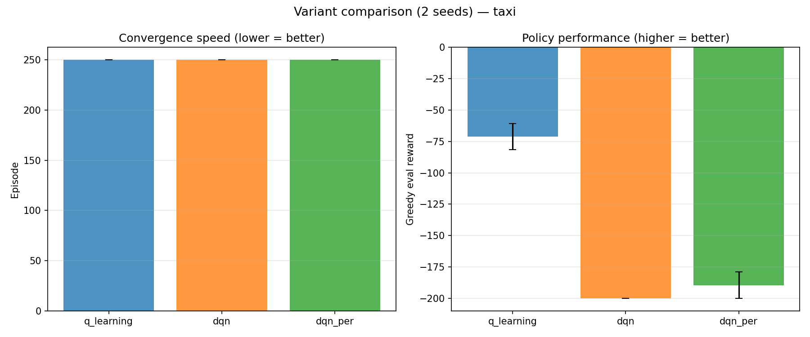

# Q-Learning vs DQN vs DQN+PER on Taxi-v3

Benchmarks the three Taxi-compatible algorithms in the registry (`q_learning`,
`dqn`, `dqn_per`) on Gymnasium's `Taxi-v3` — 500 discrete states, 6 actions —
using the same convergence/comparison harness as the rest of the pipeline.

## Headline results

| | Eval reward | Detail |
|---|---|---|
| **Q-Learning** | **+8.83** | 1200 ep, 1 seed, 90% success |
| **DQN** | **-175.1** | 500 ep, 2 seeds, 10% success |
| **DQN+PER** | **-139.1** | 500 ep, 2 seeds, 26% success |
| **Wall-clock, 250 ep** | 0.34s vs 163-198s | q_learning vs dqn / dqn_per |

### Reading these numbers: Taxi-v3's reward scale

Every step costs **-1**, a successful drop-off pays **+20**, an illegal
pickup/drop-off costs **-10**, and an episode is cut off at **200 steps**. So a
positive average (Q-Learning's **+8.83**) means the taxi reaches the passenger
and destination in efficient trips (~12 steps). A large negative average
(DQN's **-175**) is not "175 units of bad" in the abstract — arithmetically
it's close to `-200` (the full 200-step timeout penalty) with a few illegal-move
penalties mixed in: **the episode almost never finishes the trip before the timeout.**

## Methodology

All runs use `core.pipeline_actions.run_benchmark` against the `convergence`
and `comparison` benchmarks already in the pipeline. Each run trains with
epsilon-greedy exploration, then evaluates the frozen greedy policy (epsilon=0)
to measure what the agent actually learned. Convergence is flagged when the
100-episode rolling-average reward first reaches `7.0`, the conventional
"solved" bar for Taxi-v3.

| Run | Episodes | Seeds | Eval episodes | Purpose |
|---|---|---|---|---|
| Q-Learning convergence | 1200 | 1 | 30 | Baseline diagnostics |
| DQN convergence | 500 | 2 | 50 | Per-algorithm diagnostics |
| DQN+PER convergence | 500 | 2 | 50 | Per-algorithm diagnostics |
| 3-way comparison | 250 | 2 | 30 | Equal-budget head-to-head |

Episode budgets differ across sections on purpose: the per-algorithm runs use
a larger budget for richer diagnostics, while the head-to-head comparison uses
a smaller, identical budget for all three so the ranking is apples-to-apples.
Wall-clock cost made anything larger impractical on this CPU-only machine.

## Q-Learning — baseline, 1200 episodes, seed 0

Tabular Q-learning solves Taxi convincingly: eval reward **+8.83 ± 2.65** over
30 greedy episodes, **90% success rate**, averaging **12.2 steps** per trip.
Training 1200 episodes takes **0.65 seconds**.

**Fig. 1.** Reward curve (top-left) crosses into positive territory by
~episode 400; the phase boxplot (bottom-right) shows the spread tightening
and its median climbing across the 5 training phases.

**Fig. 2.** Each column is a ~60-episode block; red (low-reward) cells
dominate the left, green cells the right — a direct visual signature of
convergence.

## DQN — Double + Dueling, 500 episodes, 2 seeds

With the registry's default hyperparameters, DQN does not solve Taxi within
this budget: eval reward **-175.1 ± 24.9**, success rate **10%**, episodes
averaging **178 of the 200-step cap**.

**Fig. 3.** Reward curve sits near its minimum for the entire 500 episodes;
the phase boxplot is flat — phase 5's median is no better than phase 1's.

**Fig. 4.** Both seeds track the same flat, negative trajectory with a narrow
±1 std band — a consistent failure mode, not seed noise.

## DQN + PER — Prioritized replay, 500 episodes, 2 seeds

Prioritized experience replay recovers some ground: eval reward
**-139.1 ± 35.3**, success rate **26%** (vs DQN's 10%), at ~20% more
wall-clock cost for the sum-tree bookkeeping.

**Fig. 5.** Same axes as Fig. 3 — the reward floor is less severe and the
phase boxplot shows mild upward drift in the later phases.

**Fig. 6.** Wider variance between seeds than Fig. 4, but a visibly less
negative mean band overall.

## Head-to-head — equal 250-episode budget, 2 seeds

| Variant | Eval reward | Success | Eval steps | Train time (s) |
|---|---|---|---|---|
| q_learning | -71.23 ± 10.37 | 56.7% | 84.2 | 0.34 |
| dqn | -200.00 ± 0.00 | 0.0% | 200.0 | 162.9 |
| dqn_per | -189.52 ± 10.48 | 5.0% | 190.6 | 198.2 |

**Fig. 7.** Q-Learning's curve climbs steadily from episode ~30 onward; both
DQN curves stay pinned near the floor for the entire 250-episode budget.

**Fig. 8.** Left: neither DQN variant converges within 250 episodes (bar sits
at the budget ceiling). Right: the eval-reward gap is large enough that the
error bars don't come close to overlapping.

## Observations from the plots

**Q-Learning's convergence is visible directly in the curve and the heatmap.**
Fig. 1's reward curve is the textbook convergence shape: noisy near-random
rewards for the first ~100 episodes, then a steady climb into positive
territory. Fig. 2 shows the same thing from a different angle — reward per
block goes from mostly red to mostly green, with no red re-appearing once it
clears.

**DQN's reward curve never leaves the floor — and the seed band shows it
isn't seed noise.** Fig. 3's curve sits near its minimum for all 500 episodes;
Fig. 4 rules out a single unlucky seed. The likely cause: `dqn` ships with
`epsilon_decay=0.95`, tuned for BeamNG's world of a few hundred long episodes.
On Taxi's short (≤200-step) episodes that decay collapses epsilon to its floor
(0.05) in **~60 episodes** — exploration stops before the agent has sampled
enough of the 500-state space. Q-Learning's own default
(`epsilon_decay=0.9975`, ~20x slower to decay) is the main variable that
differs between a curve that climbs (Fig. 1) and one that doesn't (Fig. 3).

**PER's plots show a real but partial recovery.** Fig. 5's phase boxplot shows
what Fig. 3's doesn't: a visible upward drift in later phases. Fig. 6's mean
line sits clearly above Fig. 4's for most of training, though its band is
wider — PER's priority sampling makes individual runs less predictable even as
it lifts the average.

**The head-to-head curves and bars agree with the per-algorithm plots.**
Fig. 7 reproduces the same shapes at a shorter, equal budget: one curve
(q_learning) climbs, two (dqn, dqn_per) stay flat. Fig. 8's right panel turns
that into non-overlapping error bars — the ranking isn't a close call at this budget.

## Process notes

Not plot-driven — tooling and environment findings from getting these runs working at all.

**Local environment was broken before any of this could run.** `.venv`
pointed at an Anaconda install (`C:\Users\moham\anaconda3`) that no longer
exists on this machine. Rebuilt the venv against the standalone Python 3.11
install with `--system-site-packages` to reuse the already-installed
torch/numpy/matplotlib, then pinned `gymnasium==1.0.0` as
`requirements.txt` specifies — the globally installed gymnasium 1.3.0 has
removed `Taxi-v3` in favor of `Taxi-v4`, which would have broken every run silently.

**DQN-on-Taxi crash: already found and fixed upstream.** Independently hit a
matmul shape-mismatch crash feeding Taxi's raw integer state into a network
built for a 500-dim input. Pulling `main` showed this was already resolved 91
commits ago via `DQNAgent._encode` (one-hot encoding), covered by
`tests/test_taxi_algorithms.py` (18/18 passing). No code change needed here.

**Wall-clock cost gap.** Tabular Q-learning trains 1200 episodes in 0.65s.
DQN/DQN+PER take ~160-200s for a quarter as many episodes (250) — a roughly
2,000-3,000x wall-clock gap, on a CPU-only machine with no GPU available in
this session.

## Next steps

- Run a small `epsilon_decay` grid-search for `dqn` / `dqn_per` on Taxi to test the hypothesis above before writing DQN off for this environment.
- Re-run the head-to-head comparison at a matched, larger episode budget.
- Reuse this exact harness (`core.pipeline_actions.run_benchmark`) on BeamNG once GPU time is available.
- New runs are synced to `web/public/data/` for the dashboard (`scripts/sync_web_data.py`) alongside the existing q_learning demo data.

---

git `e278fd4` · Python 3.11.9 · torch 2.12.0+cpu · device: cpu · Windows · 2026-07-03
