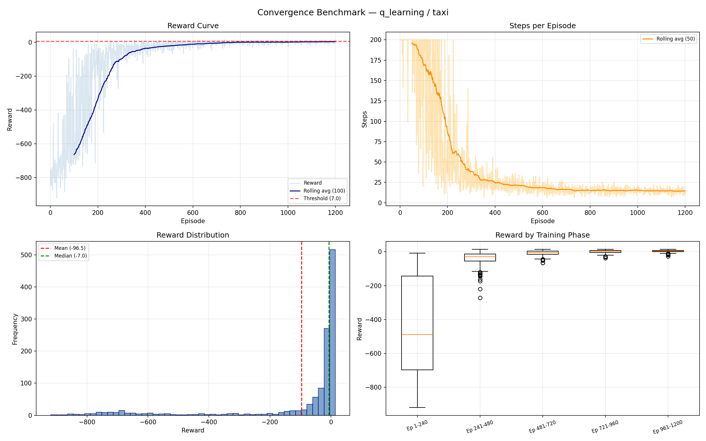
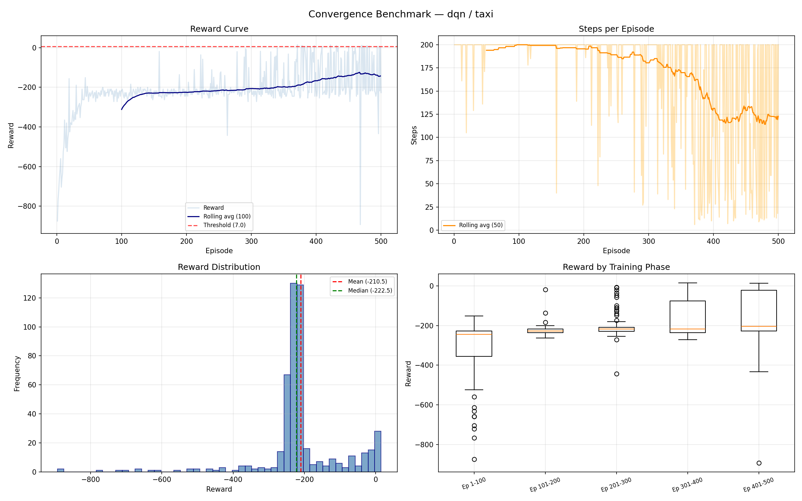
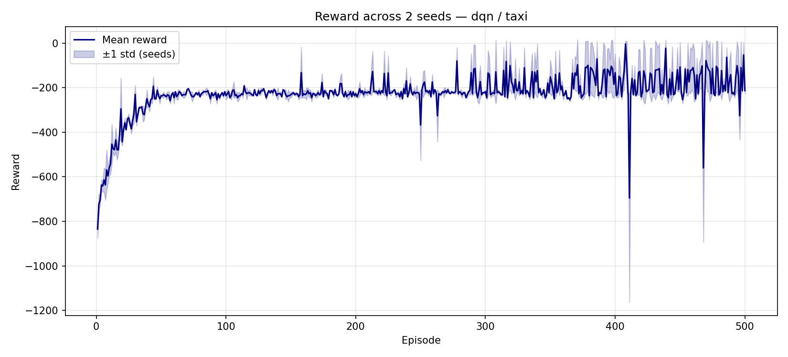
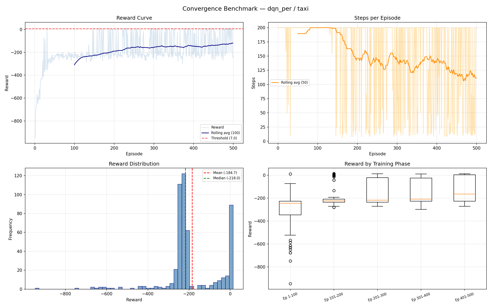
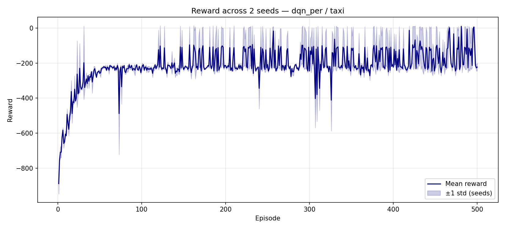
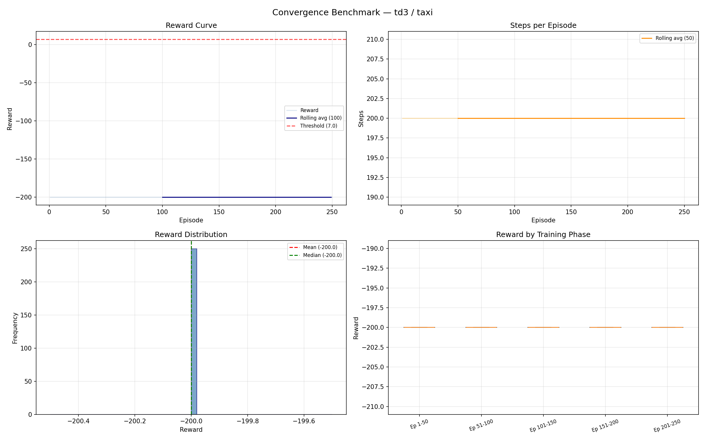
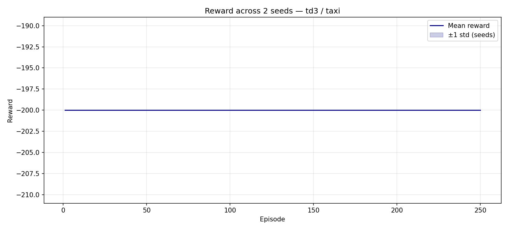

# Cinq algorithmes sur Taxi-v3 : Q-Learning, DQN, DQN+PER, TD3, DDPG

Benchmark de tous les algorithmes compatibles Taxi du registre (`q_learning`,
`dqn`, `dqn_per`, `td3`, `ddpg`) sur `Taxi-v3` de Gymnasium — 500 états
discrets, 6 actions — avec le même harnais de convergence/comparaison que le
reste du pipeline.

## Résultats clés

| | Reward d'eval | Détail |
|---|---|---|
| **Q-Learning** | **+8.83** | 1200 ep, 1 seed, 90% succès |
| **DQN** | **-175.1** | 500 ep, 2 seeds, 10% succès |
| **DQN+PER** | **-139.1** | 500 ep, 2 seeds, 26% succès |
| **TD3** | **-200.0** | 250 ep, 2 seeds, 0% succès, variance nulle |
| **DDPG** | **-200.0** | 80 ep, 1 seed, 0% succès, variance nulle |
| **Params vs table Q (3 000)** | 1x → 130x | q_learning → dqn (38x) → td3 (81x) → ddpg (130x) |

### Comment lire ces chiffres : l'échelle de reward de Taxi-v3

Chaque pas coûte **-1**, une dépose réussie rapporte **+20**, une prise en
charge/dépose illégale coûte **-10**, et un épisode est coupé au bout de
**200 pas**. Une moyenne positive (le **+8.83** de Q-Learning) signifie que le
taxi atteint le passager puis la destination en trajets efficaces (~12 pas).
Une moyenne très négative (le **-175** de DQN) n'est pas "175 unités de
mauvais" dans l'absolu — arithmétiquement, c'est proche de `-200` (la pénalité
complète du timeout à 200 pas) avec quelques pénalités d'action illégale
mélangées : **l'épisode ne termine quasiment jamais le trajet avant le
timeout.** Le **-200.0 exact à variance nulle** de TD3/DDPG va un cran plus
loin : pas juste un timeout, mais le *même* timeout sur chaque épisode et
chaque seed.

## Méthodologie

Tous les runs utilisent `core.pipeline_actions.run_benchmark` avec les
benchmarks `convergence` et `comparison` déjà présents dans le pipeline.
Chaque run entraîne avec exploration epsilon-greedy, puis évalue la politique
greedy figée (epsilon=0) pour mesurer ce que l'agent a vraiment appris. La
convergence est signalée quand la moyenne glissante sur 100 épisodes atteint
`7.0`, le seuil conventionnel de "résolu" pour Taxi-v3.

| Run | Épisodes | Seeds | Épisodes d'eval | Objectif |
|---|---|---|---|---|
| Q-Learning convergence | 1200 | 1 | 30 | Diagnostics de référence |
| DQN convergence | 500 | 2 | 50 | Diagnostics par algorithme |
| DQN+PER convergence | 500 | 2 | 50 | Diagnostics par algorithme |
| TD3 convergence | 250 | 2 | 30 | Diagnostics par algorithme |
| DDPG convergence | 80 | 1 | 30 | Diagnostics par algorithme (budget réduit) |
| Comparaison à 3 | 250 | 2 | 30 | Face-à-face à budget égal |

Les budgets d'épisodes diffèrent volontairement selon les sections : les runs
par algorithme utilisent un budget plus large pour des diagnostics plus
riches, tandis que le face-à-face utilise un budget plus petit et identique
pour les trois afin que le classement soit comparable. Le coût en temps réel a
rendu tout budget plus grand impraticable sur cette machine sans GPU — DDPG en
particulier a reçu un budget bien plus petit car ses hyperparamètres par
défaut le rendent environ 6x plus lent par épisode que DQN.

`td3` et `ddpg` sont des algorithmes de contrôle continu (acteur-critique)
conçus pour la sortie direction/accélération de BeamNG, pas pour des
environnements discrets. Le pipeline les adapte à Taxi en faisant scorer les 6
actions par l'acteur puis en prenant l'argmax — la même astuce utilisée pour
leur décalage d'espace d'action BeamNG-vs-Taxi. Les faire tourner dans la
suite de benchmarks a révélé une vraie lacune dans le harnais lui-même ; voir
[notes de processus](#notes-de-processus).

## Q-Learning — référence, 1200 épisodes, seed 0

Le Q-learning tabulaire résout Taxi de façon convaincante : reward d'eval
**+8.83 ± 2.65** sur 30 épisodes greedy, **90% de taux de succès**, en
moyenne **12.2 pas** par trajet. Entraîner 1200 épisodes prend
**0.65 seconde**.

**Fig. 1.** La courbe de reward (en haut à gauche) passe en territoire positif
vers l'épisode ~400 ; le boxplot par phase (en bas à droite) montre l'écart
qui se resserre et sa médiane qui grimpe au fil des 5 phases d'entraînement.

**Fig. 2.** Chaque colonne est un bloc de ~60 épisodes ; les cellules rouges
(reward faible) dominent à gauche, les vertes à droite — une signature
visuelle directe de convergence.

## DQN — Double + Dueling, 500 épisodes, 2 seeds

Avec les hyperparamètres par défaut du registre, DQN ne résout pas Taxi dans
ce budget : reward d'eval **-175.1 ± 24.9**, taux de succès **10%**, épisodes
durant en moyenne **178 des 200 pas** du plafond.

**Fig. 3.** La courbe de reward reste près de son minimum pendant les 500
épisodes entiers ; le boxplot par phase est plat — la médiane de la phase 5
n'est pas meilleure que celle de la phase 1.

**Fig. 4.** Les deux seeds suivent la même trajectoire plate et négative avec
une bande étroite à ±1 écart-type — un mode d'échec cohérent, pas du bruit de
seed.

## DQN + PER — Replay priorisé, 500 épisodes, 2 seeds

Le replay d'expérience priorisé récupère un peu de terrain : reward d'eval
**-139.1 ± 35.3**, taux de succès **26%** (contre 10% pour DQN), pour ~20% de
temps réel en plus pour la gestion du sum-tree.

**Fig. 5.** Mêmes axes que la Fig. 3 — le plancher de reward est moins sévère
et le boxplot par phase montre une légère dérive vers le haut dans les phases
tardives.

**Fig. 6.** Variance plus large entre les seeds que la Fig. 4, mais une bande
moyenne visiblement moins négative dans l'ensemble.

## TD3 — Twin Delayed DDPG, 250 épisodes, 2 seeds

TD3 ne fait pas qu'échouer à résoudre Taxi — il converge vers une seule
impasse parfaitement reproductible : reward d'eval exactement
**-200.0 ± 0.0** sur les 30 épisodes d'eval, les deux seeds, **0% de succès**,
chaque épisode allant jusqu'au bout des 200 pas sans la moindre pénalité de
mouvement illégal. La politique greedy ne galère pas — elle est bloquée à
répéter des mouvements légaux mais inutiles, avec une certitude mathématique.

**Fig. 7.** Chaque panneau est plat : la courbe de reward est une ligne
parfaitement droite à -200, et le boxplot par phase montre une hauteur
littéralement nulle (variance nulle) dans chacune des 5 phases.

**Fig. 8.** Aucune bande visible du tout — les deux seeds produisent
exactement la même trajectoire à -200 dès l'épisode 1, donc il n'y a rien à
montrer pour une ombre ±1 écart-type.

## DDPG — bruit OU, 80 épisodes, 1 seed, budget réduit

La config par défaut de DDPG (`hidden=256`, `updates_per_step=4`) en fait de
loin l'agent le plus lent du registre — **~15.8s/épisode** ici, donc ce run
utilise un budget réduit à 80 épisodes, seed unique, uniquement pour rester
dans des limites raisonnables. Pendant l'entraînement (avec le bruit
d'exploration Ornstein-Uhlenbeck actif), le reward est bruité et souvent pire
que -200 (meilleur **-328**, pire **-893**, moyenne **-602**) — mais une fois
le bruit retiré pour l'eval greedy, il atterrit sur *exactement la même*
impasse que TD3 : **-200.0 ± 0.0**, 0% de succès, chaque épisode qui timeout.

**Fig. 9.** Contrairement à la Fig. 7, la courbe de reward bouge ici — mais
vers le bas et de façon bruitée, poussée par le bruit OU qui pousse l'acteur
vers des mouvements illégaux. Le boxplot par phase montre un large
éparpillement, pas de convergence.

**Fig. 10.** Presque entièrement rouge/orange (reward faible) du début à la
fin — aucun bloc vert n'apparaît jamais, contrairement à l'amélioration nette
de gauche à droite de la Fig. 2.

## Les algorithmes de contrôle continu sont surdimensionnés pour un problème à 500 états et 6 actions

TD3 et DDPG existent pour gérer des espaces d'action continus (direction et
accélération de BeamNG) — critiques jumeaux, mises à jour de politique
différées, lissage de la politique cible, et bruit Ornstein-Uhlenbeck sont
tous des mécanismes construits pour stabiliser l'apprentissage d'un signal de
contrôle *continu*. Rien de tout ça n'a de rapport avec le choix parmi 6
mouvements discrets dans un monde à 500 états assez petit pour tenir dans une
table de correspondance :

| Algorithme | Params entraînables | vs table Q | Modules réseau | s / épisode |
|---|---|---|---|---|
| q_learning | 3 000 | 1x | 1 table de correspondance | 0.0005 |
| dqn | 114 567 | 38x | réseau en ligne + cible | ~2.6 |
| td3 | 244 488 | 81x | acteur+cible, critique jumeau+cible | ~5.7 |
| ddpg | 391 431 | 130x | acteur+cible, critique+cible | ~15.8 |

Les comptes de paramètres sont acteur+critique uniquement (hors les copies de
réseaux cibles, qui doublent à peu près les tenseurs en mémoire). La "table"
du Q-learning fait 500x6 flottants, sans gradient ni forward/backward du tout.

## Face-à-face — budget égal de 250 épisodes, 2 seeds

| Variante | Reward d'eval | Succès | Pas d'eval | Temps d'entraînement (s) |
|---|---|---|---|---|
| q_learning | -71.23 ± 10.37 | 56.7% | 84.2 | 0.34 |
| dqn | -200.00 ± 0.00 | 0.0% | 200.0 | 162.9 |
| dqn_per | -189.52 ± 10.48 | 5.0% | 190.6 | 198.2 |

TD3/DDPG sont volontairement exclus de ce graphique précis : à ce budget, TD3
seul ajouterait ~48 minutes et la config par défaut de DDPG rend un run à
budget égal impraticablement lent (leurs sections dédiées ci-dessus font déjà
le point de comparaison clairement).

**Fig. 11.** La courbe de Q-Learning grimpe régulièrement à partir de
l'épisode ~30 ; les deux courbes DQN restent scotchées près du plancher sur
tout le budget de 250 épisodes.

**Fig. 12.** Gauche : aucune variante DQN ne converge en 250 épisodes (la
barre est au plafond du budget). Droite : l'écart de reward d'eval est assez
grand pour que les barres d'erreur ne se chevauchent même pas.

## Observations tirées des graphes

**La convergence de Q-Learning est visible directement dans la courbe et la
heatmap.** La courbe de reward de la Fig. 1 a la forme classique de
convergence : reward bruité et quasi aléatoire pendant les ~100 premiers
épisodes, puis une montée régulière en territoire positif. La Fig. 2 montre
la même chose sous un autre angle — le reward par bloc passe de
majoritairement rouge à majoritairement vert, sans que le rouge ne
réapparaisse une fois passé.

**La courbe de reward de DQN ne quitte jamais le plancher — et la bande de
seeds montre que ce n'est pas du bruit.** La courbe de la Fig. 3 reste près
de son minimum pendant les 500 épisodes ; la Fig. 4 écarte l'hypothèse d'une
seed malchanceuse isolée. La cause probable : `dqn` a pour défaut
`epsilon_decay=0.95`, calibré pour l'univers de BeamNG fait de quelques
centaines d'épisodes longs. Sur les épisodes courts (≤200 pas) de Taxi, cette
décroissance fait tomber epsilon à son plancher (0.05) en **~60 épisodes** —
l'exploration s'arrête avant que l'agent ait assez échantillonné les 500
états. Le défaut propre de Q-Learning (`epsilon_decay=0.9975`, ~20x plus lent
à décroître) est la principale variable qui distingue une courbe qui grimpe
(Fig. 1) d'une qui ne grimpe pas (Fig. 3).

**Les graphes de PER montrent une vraie récupération, mais partielle.** Le
boxplot par phase de la Fig. 5 montre ce que celui de la Fig. 3 ne montre
pas : une dérive visible vers le haut dans les phases tardives. La ligne
moyenne de la Fig. 6 se situe nettement au-dessus de celle de la Fig. 4 pour
la majeure partie de l'entraînement, même si sa bande est plus large —
l'échantillonnage priorisé de PER rend les runs individuels moins
prévisibles tout en relevant la moyenne.

**Les courbes et barres du face-à-face confirment les graphes par
algorithme.** La Fig. 11 reproduit les mêmes formes à budget plus court mais
égal : une courbe (q_learning) grimpe, deux (dqn, dqn_per) restent plates. Le
panneau de droite de la Fig. 12 traduit ça en barres d'erreur qui ne se
chevauchent pas — le classement n'est pas serré à ce budget.

**La ligne plate de TD3 est une signature d'échec plus forte que le bruit de
DQN.** La courbe de reward de la Fig. 3 est très négative mais garde du bruit
visible d'un épisode à l'autre. La Fig. 7 n'en a aucun — chaque boîte de
phase a une hauteur nulle, et la Fig. 8 ne montre aucune bande ombrée car les
deux seeds tombent sur la trajectoire identique. Un réseau qui se comporte de
façon identique entre seeds aléatoires, jusqu'au reward exact, n'est pas
"lent à apprendre" : il a trouvé un point fixe précis (un cycle de
mouvements légaux qui n'atteint jamais la destination) et le pont
argmax-sur-scores-de-l'acteur ne le laisse jamais s'en échapper.

**Les graphes de DDPG montrent du bruit sans progrès, puis la même impasse
que TD3.** La courbe de reward de la Fig. 9 est la seule des cinq qui
descend pendant l'entraînement — visible directement dans le creux vers -900
poussé par le bruit OU autour de l'épisode 15. La Fig. 10 confirme qu'il n'y
a pas de récupération : aucun bloc vert n'apparaît jamais, contrairement au
net passage de gauche à droite de la Fig. 2. Une fois le bruit d'exploration
coupé pour l'eval greedy, l'acteur de DDPG converge vers exactement la même
ligne plate à -200.0 que la Fig. 7 — deux algorithmes différents, deux
tailles de réseau différentes, le même point fixe dégénéré.

## Notes de processus

Pas basé sur les graphes — observations d'outillage et d'environnement
rencontrées en essayant simplement de faire tourner ces runs.

**Vrai bug de harnais trouvé et corrigé : agents de contrôle continu sur
environnements discrets.** Faire tourner `td3`/`ddpg` via
`benchmarks.convergence` plantait immédiatement : `TypeError: unhashable
type: 'numpy.ndarray'` à l'intérieur du `step()` de Taxi. Contrairement au bug
one-hot de DQN ci-dessous, celui-ci n'était **pas** déjà corrigé sur `main`.
Cause racine : `core.pipeline_actions.build_agent` (utilisé pour
l'entraînement) injecte `state_type="discrete"` pour que TD3/DDPG basculent
en mode état-one-hot / argmax-sur-scores — mais `benchmarks/convergence.py`,
`comparison.py` et `gridsearch.py` construisent chacun l'agent directement
via `agent_cls(**params)` sans jamais le régler, donc l'agent restait
silencieusement en mode continu et émettait une action flottante dans un env
`Discrete(6)`. Corrigé en ajoutant `BaseBenchmark._finalize_agent_params()`
(reproduit le garde-fou de `build_agent` : ne règle `state_type` que si la
classe d'agent l'accepte réellement) et en l'appelant depuis les trois
classes de benchmark. Vérifié contre la suite existante de 27 tests
benchmark/taxi plus la suite complète de 157 tests hors BeamNG — tout passe.

**L'environnement local était cassé avant même de pouvoir lancer quoi que ce
soit.** `.venv` pointait vers une install Anaconda
(`C:\Users\moham\anaconda3`) qui n'existe plus sur cette machine.
Reconstruit le venv sur l'install Python 3.11 autonome avec
`--system-site-packages` pour réutiliser torch/numpy/matplotlib déjà
installés, puis épinglé `gymnasium==1.0.0` comme le spécifie
`requirements.txt` — la gymnasium 1.3.0 installée globalement a supprimé
`Taxi-v3` au profit de `Taxi-v4`, ce qui aurait cassé silencieusement chaque
run.

**Crash de DQN sur Taxi : déjà trouvé et corrigé en amont.** Tombé
indépendamment sur un crash de dimensions de matmul en donnant l'état entier
brut de Taxi directement à un réseau construit pour une entrée en 500
dimensions. Tirer `main` a montré que c'était déjà résolu 91 commits plus tôt
via `DQNAgent._encode` (encodage one-hot), couvert par
`tests/test_taxi_algorithms.py` (18/18 passants). Aucun changement de code
nécessaire ici.

**L'écart de coût en temps réel se creuse fortement à mesure que les réseaux
grossissent.** Le Q-learning tabulaire entraîne 1200 épisodes en 0.65s. DQN
fait en moyenne ~2.6s/épisode, TD3 ~5.7s/épisode, DDPG ~15.8s/épisode par
défaut — un écart par épisode d'environ **29 000x** entre Q-learning et
DDPG, sur une machine CPU seule sans GPU disponible dans cette session.
Attendu pour un problème discret à 500 états (aucun forward/backward ne bat
une lecture de table Q), mais l'écart suit presque exactement le tableau de
paramètres ci-dessus : plus de réseau, plus de temps réel, pour un résultat
pire sur cet environnement précis.

## Prochaines étapes

- Lancer une petite recherche sur grille d'`epsilon_decay` pour `dqn` / `dqn_per` sur Taxi pour tester l'hypothèse ci-dessus avant d'écarter DQN pour cet environnement.
- Relancer le face-à-face avec un budget d'épisodes plus grand et identique.
- Pour TD3/DDPG sur Taxi en particulier : le mécanisme d'exploration (bruit gaussien/OU sur les scores continus de l'acteur) est probablement le mauvais outil pour un choix discret à 6 voies — ça vaudrait le coup d'essayer un epsilon-greedy simple sur les scores de l'acteur au lieu du bruit permanent actuel, avant de conclure que ces architectures ne peuvent tout simplement pas marcher ici.
- Réutiliser ce même harnais (`core.pipeline_actions.run_benchmark`) sur BeamNG dès qu'un GPU est disponible — aucun changement de script nécessaire, juste un budget de temps réel plus long. C'est là que la conception contrôle-continu de TD3/DDPG a réellement sa place.
- Les nouveaux runs sont synchronisés vers `web/public/data/` pour le dashboard (`scripts/sync_web_data.py`) aux côtés des données de démo q_learning existantes.

---

git `235b413` · Python 3.11.9 · torch 2.12.0+cpu · device: cpu · Windows · 2026-07-03 / 2026-07-05
