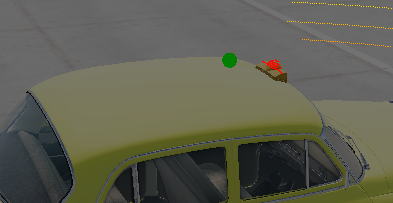

# On Beamng Environment

First Issue:
The algorithm don't see what's around them.
I added lidar to be able to scan what's around them.
Not confident on the calcul of the closer point with this, i let claude generate this code.

Second Issue:
The code that was issued by claude didn't seem to work. So i've the lidar to the beamng human play and look at the value sent to the algorithm.
And my prediction revealed to be corrected. Without moving, the value of the closer point keep changing, which indicated that there were some issues.

Third Issue:
The taxi light were blocking the lidar radar system and the fov where to wide which made the ai see less.


Fourth Issue:
the ia goes in reverse even with all this fix for no apparent cause.
```
self.vehicle.control(throttle=0.0, steering=0.0, brake=1.0)
```
Cause the ia to go in reverse, since beamng Automatic shifting makes it that if you are standing still and tries to brake, the reverse engages.

Fifth issue:
The lidar is directly attached to the car, with how bad the suspension of it, it will skew the result of the lidar. The fix is to give the pitch and roll of the car to the algo to better understand the position of the car.

Sixth issue:
Last follow-up i was asked how we can see if a new changement actually improved the algorithm. For this, i've added a multi agent and multiple environment as to test different combination at the same time. It's not a perfect solution as the vehicule as collision as well as lidar rays (which doesn't have a fix).
