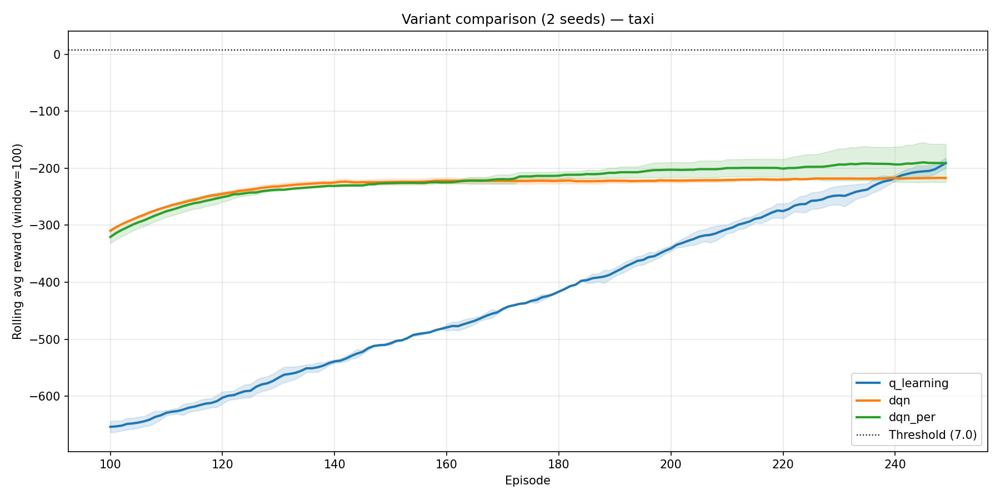

# Variant Comparison Report

**Environment:** `taxi`  
**Date:** 2026-07-03 12:38:18  
**Seeds:** [0, 1] (2 runs)  
**Threshold:** 7.0  
**Rolling window:** 100  

## Results (mean ± std across seeds)

| Variant | Converged | Conv. episode | Eval reward | Eval success | Eval steps | Time (s) |
|---------|-----------|--------------|-------------|--------------|-----------|----------|
| q_learning | 0% | — | -71.2334 ± 10.3666 | 0.5666 ± 0.0333 | 84.185 ± 9.315 | 0.34 ± 0.0 |
| dqn | 0% | — | -200.0 ± 0.0 | 0.0 ± 0.0 | 200.0 ± 0.0 | 162.885 ± 1.975 |
| dqn_per | 0% | — | -189.5166 ± 10.4834 | 0.05 ± 0.05 | 190.565 ± 9.435 | 198.205 ± 14.275 |

## Plots

### Reward curves (mean ± std band)

### Summary bars

## Reproducibility

| Field | Value |
|-------|-------|
| git_commit | e278fd4 |
| python | 3.11.9 |
| platform | Windows-10-10.0.26200-SP0 |
| numpy | 1.26.4 |
| torch | 2.12.0+cpu |
| device | cpu |
| benchmark | comparison |
| algo | q_learning+dqn+dqn_per |
| env | taxi |
| seeds | [0, 1] |
