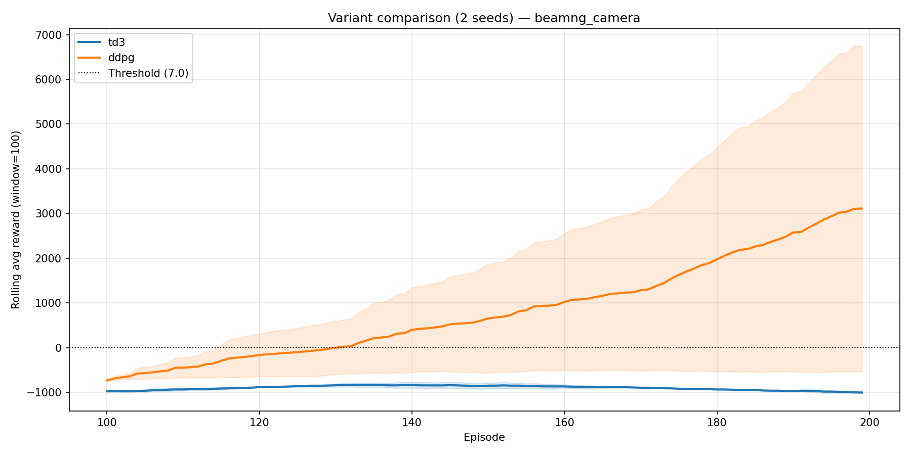
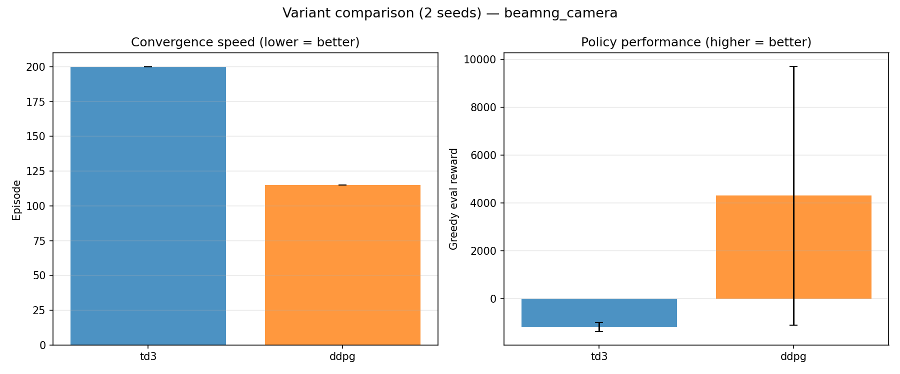

# Variant Comparison Report

**Environment:** `beamng_camera`  
**Date:** 2026-07-15 03:50:23  
**Seeds:** [0, 1] (2 runs)  
**Threshold:** 7.0  
**Rolling window:** 100  

## Results (mean ± std across seeds)

| Variant | Converged | Conv. episode | Eval reward | Eval success | Eval steps | Time (s) |
|---------|-----------|--------------|-------------|--------------|-----------|----------|
| td3 | 0% | — | -1182.2435 ± 190.3688 | 0.0 ± 0.0 | 17.25 ± 8.15 | 4880.83 ± 1256.07 |
| ddpg | 50% | 115.0 ± 0.0 | 4307.6625 ± 5402.7789 | 0.5 ± 0.5 | 128.15 ± 9.75 | 18800.645 ± 3126.215 |

## Plots

### Reward curves (mean ± std band)

### Summary bars

## Reproducibility

| Field | Value |
|-------|-------|
| git_commit | unknown |
| python | 3.11.9 |
| platform | Windows-10-10.0.26200-SP0 |
| numpy | 2.2.3 |
| torch | 2.5.1+cu121 |
| device | cuda |
| benchmark | comparison |
| algo | td3+ddpg |
| env | beamng_camera |
| seeds | [0, 1] |
