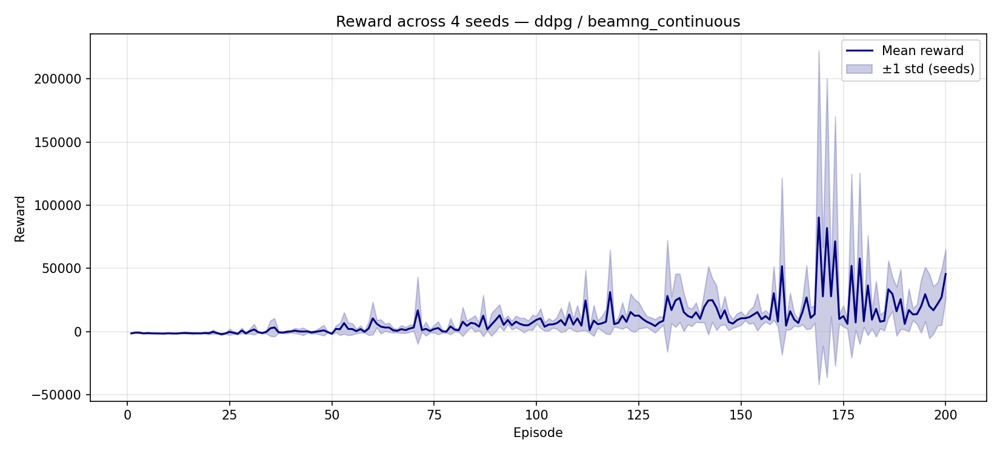

# convergence — Multi-seed Report

**Algorithm:** `ddpg`  
**Environment:** `beamng_continuous`  
**Date:** 2026-07-10 10:46:17  
**Seeds:** [0, 1, 2, 3] (4 runs)  

## Aggregated Metrics

| Metric | Mean ± Std | CI95 | Min | Max |
|--------|-----------|------|-----|-----|
| convergence_episode | 100.0 ± 0.0 | ±0.0 | 100.0 | 100.0 |
| total_episodes | 200.0 ± 0.0 | ±0.0 | 200.0 | 200.0 |
| training_time_s | 10458.275 ± 1552.1672 | ±1521.1239 | 8814.94 | 12900.52 |
| threshold | 7.0 ± 0.0 | ±0.0 | 7.0 | 7.0 |
| window | 100.0 ± 0.0 | ±0.0 | 100.0 | 100.0 |
| final_avg_reward | 24348.2685 ± 10093.6732 | ±9891.7997 | 11311.4983 | 37791.3042 |
| final_std_reward | 39685.5588 ± 16603.245 | ±16271.1801 | 18483.8816 | 60167.3389 |
| best_reward | 221774.0048 ± 85697.7861 | ±83983.8304 | 104170.4293 | 318636.0282 |
| best_episode | 174.5 ± 4.7697 | ±4.6743 | 169.0 | 181.0 |
| worst_reward | -2721.7715 ± 451.7992 | ±442.7632 | -3352.4884 | -2264.0708 |
| worst_episode | 54.75 ± 44.1269 | ±43.2444 | 20.0 | 129.0 |
| mean_reward | 9643.7316 ± 3839.2255 | ±3762.441 | 3979.8228 | 14605.4276 |
| median_reward | 4478.0103 ± 3013.493 | ±2953.2231 | 1439.7464 | 8632.6255 |
| q25_reward | 56.828 ± 1108.66 | ±1086.4868 | -960.9432 | 1927.1883 |
| q75_reward | 11085.1655 ± 5340.4112 | ±5233.603 | 3884.9427 | 18885.7456 |
| improvement_rate | 161.8369 ± 70.9545 | ±69.5354 | 71.2577 | 268.3463 |
| mean_steps | 111.05 ± 16.806 | ±16.4698 | 93.81 | 137.75 |
| max_steps | 500.0 ± 0.0 | ±0.0 | 500.0 | 500.0 |
| min_steps | 6.5 ± 0.866 | ±0.8487 | 6.0 | 8.0 |
| eval_episodes | 10.0 ± 0.0 | ±0.0 | 10.0 | 10.0 |
| eval_mean_reward | 75134.6288 ± 50083.4358 | ±49081.7671 | 15642.0875 | 130763.0103 |
| eval_std_reward | 70565.7305 ± 47564.3562 | ±46613.0691 | 21262.4717 | 121279.6844 |
| eval_mean_steps | 183.225 ± 47.1426 | ±46.1998 | 141.1 | 263.2 |
| eval_success_rate | 0.975 ± 0.0433 | ±0.0424 | 0.9 | 1.0 |

## Plots

## Reproducibility

| Field | Value |
|-------|-------|
| git_commit | unknown |
| python | 3.11.9 |
| platform | Windows-10-10.0.26200-SP0 |
| numpy | 2.2.3 |
| torch | 2.5.1+cu121 |
| device | cuda |
| benchmark | convergence |
| algo | ddpg |
| env | beamng_continuous |
| seeds | [0, 1, 2, 3] |
| n_seeds | 4 |
