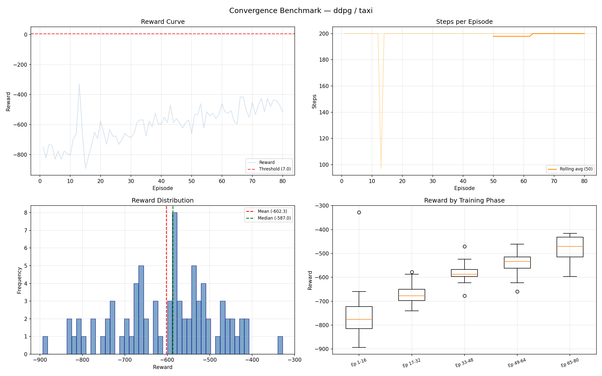
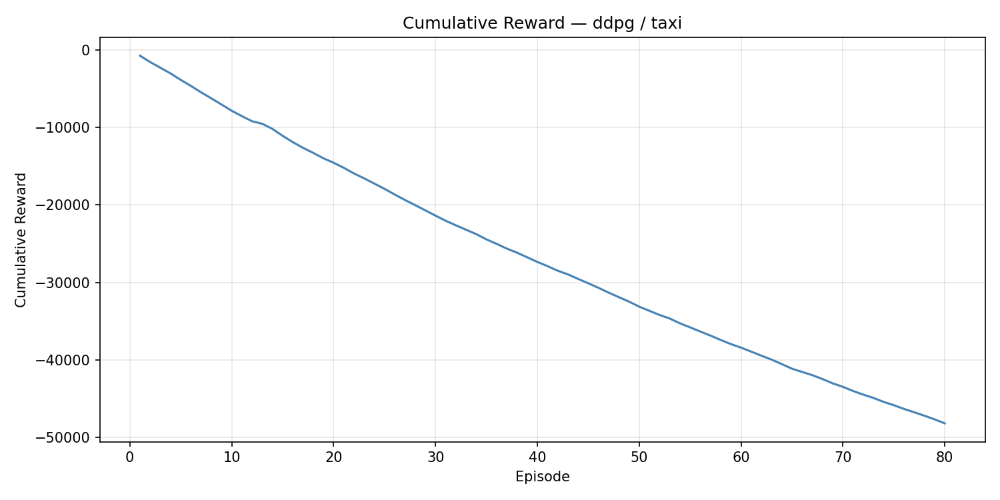
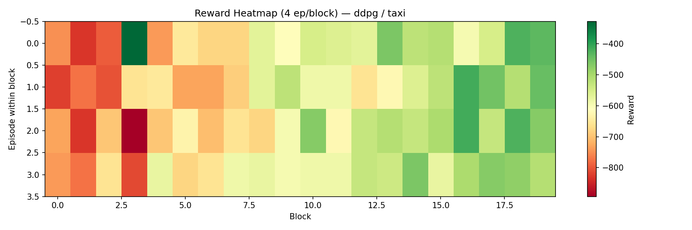

# Convergence Benchmark Report

**Algorithm:** `ddpg`  
**Environment:** `taxi`  
**Date:** 2026-07-05 19:39:36  
**Training time:** 1264.32s  

---

## Convergence

| Metric | Value |
|--------|-------|
| Converged | No |
| Convergence episode | N/A |
| Threshold | 7.0 |
| Window size | 100 |
| Total episodes | 80 |
| Improvement rate | 0.000000 reward/ep |

## Reward Statistics

| Metric | Value |
|--------|-------|
| Mean | -602.325 |
| Median | -587.0 |
| Q25 | -677.0 |
| Q75 | -521.75 |
| Best | -328.0 (ep 13) |
| Worst | -893.0 (ep 15) |
| Final avg (last 20%) | -477.875 |
| Final std (last 20%) | 51.8843 |

## Greedy Evaluation (epsilon=0)

| Metric | Value |
|--------|-------|
| Eval episodes | 30 |
| Eval mean reward | -200.0 |
| Eval std reward | 0.0 |
| Eval success rate | 0.0 |
| Eval mean steps | 200.0 |

## Steps Statistics

| Metric | Value |
|--------|-------|
| Mean steps/ep | 198.71 |
| Max steps | 200 |
| Min steps | 97 |

## Agent Configuration

```json
{
  "gamma": 0.99,
  "tau": 0.005,
  "epsilon": 0.44752321376381066,
  "epsilon_min": 0.05,
  "epsilon_decay": 0.99,
  "batch_size": 128
}
```

## Plots

### Training Overview


### Cumulative Reward


### Reward Heatmap


## Reproducibility

| Field | Value |
|-------|-------|
| git_commit | 235b413 |
| python | 3.11.9 |
| platform | Windows-10-10.0.26200-SP0 |
| numpy | 1.26.4 |
| torch | 2.12.0+cpu |
| device | cpu |
| benchmark | convergence |
| algo | ddpg |
| env | taxi |
