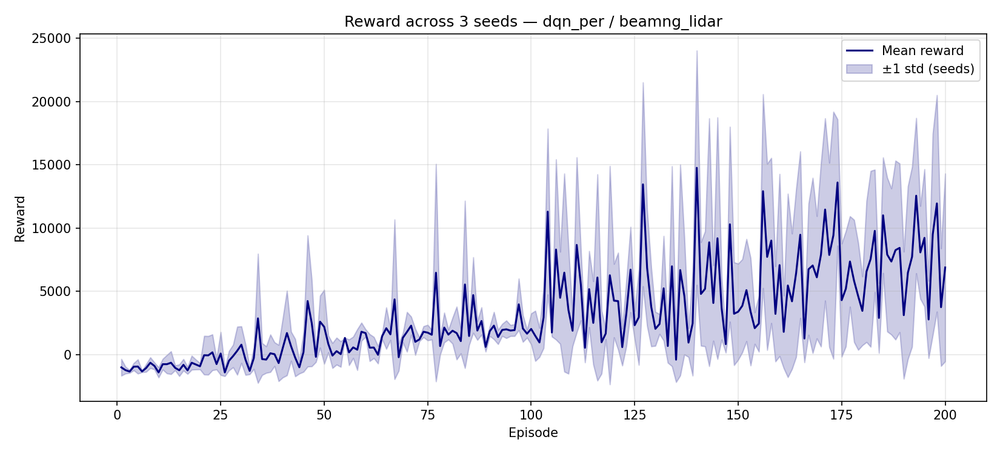

# convergence — Multi-seed Report

**Algorithm:** `dqn_per`  
**Environment:** `beamng_lidar`  
**Date:** 2026-07-15 19:55:18  
**Seeds:** [0, 1, 2] (3 runs)  

## Aggregated Metrics

| Metric | Mean ± Std | CI95 | Min | Max |
|--------|-----------|------|-----|-----|
| convergence_episode | 100.0 ± 0.0 | ±0.0 | 100.0 | 100.0 |
| total_episodes | 200.0 ± 0.0 | ±0.0 | 200.0 | 200.0 |
| training_time_s | 6919.2967 ± 2512.0163 | ±2842.6141 | 4729.54 | 10436.79 |
| threshold | 7.0 ± 0.0 | ±0.0 | 7.0 | 7.0 |
| window | 100.0 ± 0.0 | ±0.0 | 100.0 | 100.0 |
| final_avg_reward | 7029.7192 ± 2048.3898 | ±2317.9712 | 5388.8721 | 9917.6452 |
| final_std_reward | 5817.6477 ± 2213.0887 | ±2504.3456 | 3250.3098 | 8651.5503 |
| best_reward | 21144.5387 ± 3206.0594 | ±3627.9978 | 16660.4221 | 23967.7592 |
| best_episode | 139.0 ± 28.178 | ±31.8864 | 104.0 | 173.0 |
| worst_reward | -2340.0247 ± 259.7585 | ±293.9444 | -2652.3402 | -2016.3678 |
| worst_episode | 121.6667 ± 61.9588 | ±70.1129 | 40.0 | 190.0 |
| mean_reward | 3216.2113 ± 1062.0942 | ±1201.8727 | 2175.0848 | 4674.382 |
| median_reward | 1713.1891 ± 327.286 | ±370.359 | 1277.707 | 2066.7268 |
| q25_reward | -302.4228 ± 283.4656 | ±320.7715 | -605.7334 | 76.2371 |
| q75_reward | 4666.9646 ± 3075.5964 | ±3480.3649 | 2066.0581 | 8986.5905 |
| improvement_rate | 47.6482 ± 23.4702 | ±26.559 | 30.0807 | 80.8207 |
| mean_steps | 76.5533 ± 28.7022 | ±32.4797 | 51.51 | 116.74 |
| max_steps | 500.0 ± 0.0 | ±0.0 | 500.0 | 500.0 |
| min_steps | 8.3333 ± 0.9428 | ±1.0669 | 7.0 | 9.0 |
| eval_episodes | 10.0 ± 0.0 | ±0.0 | 10.0 | 10.0 |
| eval_mean_reward | 11375.9824 ± 3002.9011 | ±3398.1025 | 8535.0485 | 15530.1179 |
| eval_std_reward | 4615.7255 ± 2946.9265 | ±3334.7612 | 460.2464 | 6968.3441 |
| eval_mean_steps | 215.8667 ± 176.8548 | ±200.13 | 45.4 | 459.6 |
| eval_success_rate | 1.0 ± 0.0 | ±0.0 | 1.0 | 1.0 |

## Plots

## Reproducibility

| Field | Value |
|-------|-------|
| git_commit | unknown |
| python | 3.11.9 |
| platform | Windows-10-10.0.26200-SP0 |
| numpy | 2.2.3 |
| torch | 2.5.1+cu121 |
| device | cuda |
| benchmark | convergence |
| algo | dqn_per |
| env | beamng_lidar |
| seeds | [0, 1, 2] |
| n_seeds | 3 |
