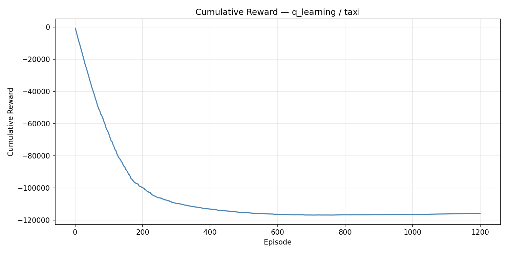
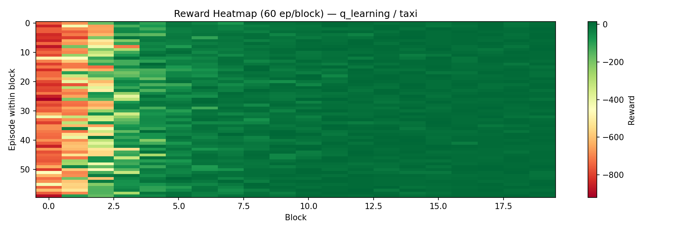

# Convergence Benchmark Report

**Algorithm:** `q_learning`  
**Environment:** `taxi`  
**Date:** 2026-07-03 12:26:09  
**Training time:** 0.65s  

---

## Convergence

| Metric | Value |
|--------|-------|
| Converged | No |
| Convergence episode | N/A |
| Threshold | 7.0 |
| Window size | 100 |
| Total episodes | 1200 |
| Improvement rate | 0.329155 reward/ep |

## Reward Statistics

| Metric | Value |
|--------|-------|
| Mean | -96.47 |
| Median | -7.0 |
| Q25 | -47.0 |
| Q75 | 4.0 |
| Best | 15.0 (ep 619) |
| Worst | -920.0 (ep 27) |
| Final avg (last 20%) | 3.3875 |
| Final std (last 20%) | 6.4662 |

## Greedy Evaluation (epsilon=0)

| Metric | Value |
|--------|-------|
| Eval episodes | 30 |
| Eval mean reward | 8.8333 |
| Eval std reward | 2.6468 |
| Eval success rate | 0.9 |
| Eval mean steps | 12.17 |

## Steps Statistics

| Metric | Value |
|--------|-------|
| Mean steps/ep | 42.05 |
| Max steps | 200 |
| Min steps | 6 |

## Agent Configuration

```json
{
  "learning_rate": 0.85,
  "discount_factor": 0.99,
  "epsilon": 0.04960040590371136,
  "epsilon_min": 0.01,
  "epsilon_decay": 0.9975
}
```

## Plots

### Training Overview


### Cumulative Reward


### Reward Heatmap


## Reproducibility

| Field | Value |
|-------|-------|
| git_commit | e278fd4 |
| python | 3.11.9 |
| platform | Windows-10-10.0.26200-SP0 |
| numpy | 1.26.4 |
| torch | 2.12.0+cpu |
| device | cpu |
| benchmark | convergence |
| algo | q_learning |
| env | taxi |
