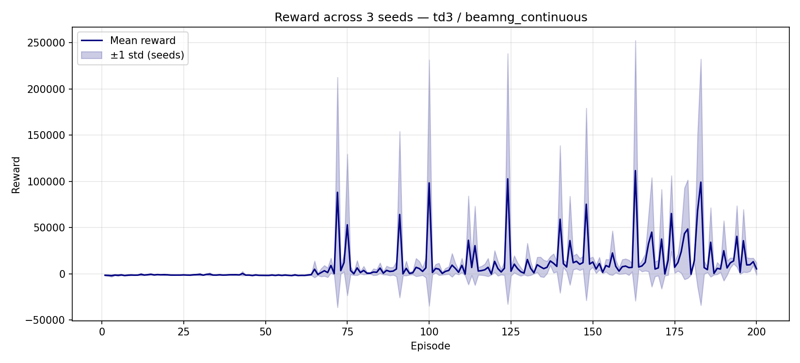

# convergence — Multi-seed Report

**Algorithm:** `td3`  
**Environment:** `beamng_continuous`  
**Date:** 2026-07-10 20:23:36  
**Seeds:** [0, 1, 2] (3 runs)  

## Aggregated Metrics

| Metric | Mean ± Std | CI95 | Min | Max |
|--------|-----------|------|-----|-----|
| convergence_episode | 113.3333 ± 18.8562 | ±21.3378 | 100.0 | 140.0 |
| total_episodes | 200.0 ± 0.0 | ±0.0 | 200.0 | 200.0 |
| training_time_s | 10270.4133 ± 2638.7767 | ±2986.0569 | 7660.72 | 13885.42 |
| threshold | 7.0 ± 0.0 | ±0.0 | 7.0 | 7.0 |
| window | 100.0 ± 0.0 | ±0.0 | 100.0 | 100.0 |
| final_avg_reward | 22785.436 ± 10501.2762 | ±11883.3127 | 13360.0967 | 37437.2926 |
| final_std_reward | 41515.2355 ± 21379.1926 | ±24192.8339 | 24125.578 | 71629.7905 |
| best_reward | 289802.47 ± 19279.0586 | ±21816.3085 | 264277.6992 | 310864.7172 |
| best_episode | 119.6667 ± 37.2767 | ±42.1826 | 72.0 | 163.0 |
| worst_reward | -2959.6219 ± 451.8308 | ±511.2947 | -3589.683 | -2552.429 |
| worst_episode | 25.6667 ± 30.6522 | ±34.6862 | 3.0 | 69.0 |
| mean_reward | 9876.2263 ± 1413.7826 | ±1599.8456 | 8130.9071 | 11593.6151 |
| median_reward | 1362.1637 ± 2050.488 | ±2320.3456 | -1328.969 | 3643.2006 |
| q25_reward | -1150.9382 ± 244.6081 | ±276.8002 | -1438.6548 | -840.7547 |
| q75_reward | 6290.8126 ± 5543.1618 | ±6272.6781 | 1823.9938 | 14103.2553 |
| improvement_rate | 153.8404 ± 71.0312 | ±80.3794 | 94.0547 | 253.6431 |
| mean_steps | 98.7833 ± 24.0644 | ±27.2315 | 74.73 | 131.66 |
| max_steps | 500.0 ± 0.0 | ±0.0 | 500.0 | 500.0 |
| min_steps | 7.3333 ± 1.8856 | ±2.1338 | 6.0 | 10.0 |
| eval_episodes | 10.0 ± 0.0 | ±0.0 | 10.0 | 10.0 |
| eval_mean_reward | 39573.3399 ± 10262.3429 | ±11612.9342 | 25200.9986 | 48506.0436 |
| eval_std_reward | 62219.5195 ± 22146.5052 | ±25061.1298 | 32595.0057 | 85834.7688 |
| eval_mean_steps | 167.8333 ± 54.3472 | ±61.4996 | 124.8 | 244.5 |
| eval_success_rate | 1.0 ± 0.0 | ±0.0 | 1.0 | 1.0 |

## Plots

## Reproducibility

| Field | Value |
|-------|-------|
| git_commit | unknown |
| python | 3.11.9 |
| platform | Windows-10-10.0.26200-SP0 |
| numpy | 2.2.3 |
| torch | 2.5.1+cu121 |
| device | cuda |
| benchmark | convergence |
| algo | td3 |
| env | beamng_continuous |
| seeds | [0, 1, 2] |
| n_seeds | 3 |
